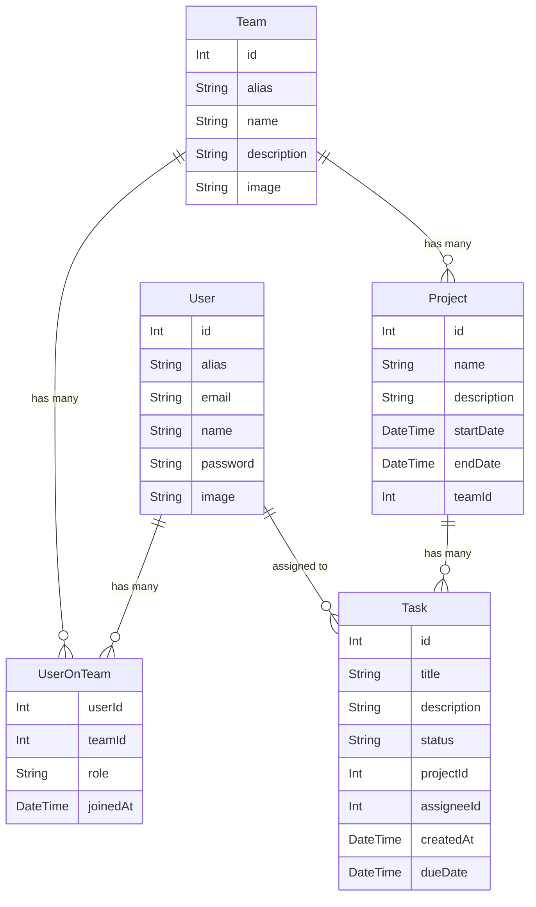

# TeamSync

<p align="center">
  
</p>

## Description

A full-stack collaboration platform built with NestJS and NextJS for managing teams, projects, and communication with role-based access control.

## Tech Stack

### Backend

- NestJS - Progressive Node.js framework
- Prisma - ORM for database interaction
- PostgreSQL - Relational database
- JWT - Authentication
- TypeScript - Type safety

### Frontend

- NextJS - React framework for production
- TypeScript - Type safety
- Tailwind CSS - Utility-first CSS framework

## Features

- User management (CRUD operations)
- Team management (CRUD operations)
- Role-based access control
- User authentication (JWT)
- Team membership management
- Real-time collaboration tools
- Project tracking and management
- Task assignment and status tracking
- File sharing and document management
- Integrated chat and notifications
- Profile images support
- Unique aliases for users and teams
- Public and protected routes
- Modern responsive UI

## Prerequisites

- Node.js (v16 or later)
- npm or yarn
- PostgreSQL database
- Prisma CLI (installed via npm/yarn)

## Project Setup

1. **Clone the repository**

   ```bash
   git clone https://github.com/rafaelguerrae/teamsync
   cd teamsync
   ```

2. **Backend Setup**

   ```bash
   cd backend
   npm install

   # Set up environment variables
   cp .env.example .env
   # Update the .env file with your database credentials and JWT_SECRET

   # Run database migrations
   npx prisma migrate dev

   # Generate Prisma client
   npx prisma generate
   ```

3. **Frontend Setup**

   ```bash
   cd frontend
   npm install

   # Set up environment variables
   cp .env.example .env.local
   # Update the frontend environment variables if needed
   ```

4. **Start the application**

   ```bash
   # Backend (from backend directory)
   npm run start:dev

   # Frontend (from frontend directory)
   npm run dev
   ```

## API Documentation

Once the backend is running, you can access the API documentation at:

- Swagger UI: `http://localhost:3000/api`
- JSON Schema: `http://localhost:3000/api-json`

## Development

### Prisma

- After making changes to `schema.prisma`, run:
  ```bash
  npx prisma generate
  npx prisma migrate dev --name your_migration_name
  ```

### Testing

```bash
# unit tests
$ npm run test

# e2e tests
$ npm run test:e2e

# test coverage
$ npm run test:cov
```

## Data Model



## Project Structure

```
/
├── backend/                  # NestJS backend
│   ├── src/
│   │   ├── app.module.ts     # Root module
│   │   ├── main.ts           # Application entry point
│   │   ├── auth/             # Authentication module
│   │   ├── database/         # Database configuration
│   │   ├── users/            # User module
│   │   ├── teams/            # Team module
│   │   ├── projects/         # Project module
│   │   ├── tasks/            # Task module
│   │   ├── messaging/        # Messaging module
│   │   ├── notifications/    # Notifications module
│   │   └── files/            # File storage module
│   └── prisma/               # Prisma schema and migrations
│
├── frontend/                 # NextJS frontend
│   ├── src/
│   │   ├── app/              # Next.js app router
│   │   ├── components/       # React components
│   │   ├── hooks/            # Custom React hooks
│   │   ├── lib/              # Utility functions
│   │   ├── services/         # API services
│   │   └── types/            # TypeScript type definitions
│   ├── public/               # Static assets
│   └── next.config.js        # Next.js configuration
```

## License

This project is [MIT licensed](LICENSE).

## Stay in touch

- Website - [https://teamsync.app](https://teamsync.app/)
- Twitter - [@TeamSyncApp](https://twitter.com/TeamSyncApp)
